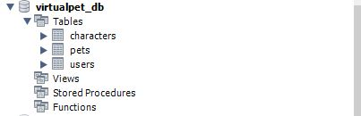
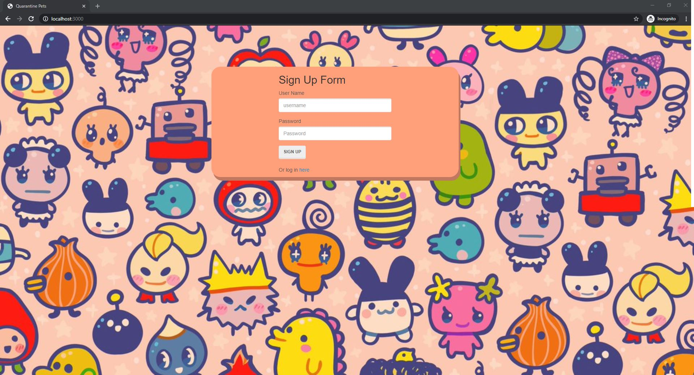

# Quarantine Pets
A group developed Full Stack application using the **MVC** design pattern.  

In our current hard times of Quarantine, people need a friend to interact with to escape.   Welcome to **Quarantine Pets!**  
A virtual pet to play with, love, and take care of in the way of the original *Tamagotchi*. 

# Authors 
> Justin Acosta, Helen Maschmeyer, Tim Shaffer, & Wayne Wu

## Contents
* [Tech Used](https://github.com/mrwu42/project2#tech-used)
* [To Install Locally](https://github.com/mrwu42/project2#to-install-locally)
* [Original Design Notes](https://github.com/mrwu42/project2#original-design-notes)

## Tech Used
* JavaScript
    * constructors
* Node.js
    * Express
        * get 
        * post
        * put
        * use
        * engine
        * set
    * Express  
    * bcrypt.js
    * mysql
    * mysql2
    * passport
    * sequelize
* HTML 
* CSS
    * SCSS
* Bootstrap
* jQuery
* MySQL
    * SQL 
        * CREATE DATABASE
        * USE DATABASE
        * CREATE TABLE
        * INSERT INTO
        * ALTER TABLE
        * SELECT 
        * UPDATE 

### MVC Directory Structure

```bash
├── project2
│   ├── config
|   │   ├── middleware
|   │   │   └── isAuthenticated.js
│   │   ├── config.js
│   │   └── passport.js
│   ├── db
│   │   ├── schema.sql
│   │   └── seeds.sql
│   ├── models
│   │   ├── Character.js
│   │   ├── index.js
│   │   ├── Pets.js
│   │   └── User.js
│   ├── public
│   |    ├── images
│   │    |   ├── typeOne
│   │    |   |   ├── asleep.png
│   │    |   |   ├── asleeptwo.png
│   │    |   |   ├── dead.png
│   │    |   |   ├── deadtwo.png
│   │    |   |   ├── dirty.png
│   │    |   |   ├── gameover.png
│   │    |   |   ├── gameoverthree.png
│   │    |   |   ├── gameovertwo.png
│   │    |   |   ├── happy.png
│   │    |   |   ├── happytwo.png
│   │    |   |   ├── hungry.png
│   │    |   |   ├── hungrytwo.png
│   │    |   |   ├── nrmlclsd.png
│   │    |   |   ├── nrmlopen.png
│   │    |   |   ├── tired.png
│   │    |   |   └── tiredtwo.png
│   │    |   └── typeTwo
│   │    |       └── happysam.png
│   |    ├── js
│   │    |   ├── index.js
│   │    |   ├── login.js
│   │    |   ├── members.js
│   │    |   └── signup.js
│   |    ├── styles
│   │    |   ├── loginSignup.css
│   │    |   ├── main.css
│   │    |   ├── scss.css
│   │    |   ├── scs.css.map
│   │    |   └── scss.scss
|   |    ├── login.html
|   |    ├── members.html
|   |    └── signup.html
│   ├── routes
│   │   ├── apiRoutes.js
│   │   └── htmlRoutes.js
│   └── test
│   │   └── canary.test.js
├── .env
├── .eslintignore
├── .eslintrc.json
├── .gitignore
├── .travis.yml
├── package-lock.json
├── package.json
├── README.md
└── server.js
```

## To Install Locally

1. Fork the the repository into your own space on GitHub
1. Clone your forked repository into your own workspace.
1. Within the terminal and the folder containing the repository, you must install the required node package dependencies defined in the **package.json** file into your folder.  Trigger the package install  

>
> npm i 
> 

4. Create an environment `.env` file to contain information needed about your particular MySQL database server to be able to connect:

        DB_HOST=????
        DB_USER=????
        DB_PASS=????
        DB_DATABASE=virtualpet_db

5. Update the specifics according to your system settings and save.
1. Open MySQL Workbench and connect to the Server that you identified in the environment variables.
1. In a new Query Window, copy and run the following commands that are also found in the `/db/schema.sql` file.

        DROP DATABASE IF EXISTS virtualpet_db;
        CREATE DATABASE virtualpet_db;

8. Within the Terminal Window, Trigger `node` to open the **server** file, starting the app and building the DB tables.

>
> node server 
> 

9. Back in the MSQL Workbench, insert a default row into the Characters table by copying and running the following commands that are also found in the `/db/seeds.sql` file.

        -- use the specified database
        use virtualpet_db;
    
        -- create defaults for the sequelized createdAt and updatedAt to be able to insert a row
        alter table characters modify column createdAt 
        timestamp DEFAULT CURRENT_TIMESTAMP ON UPDATE CURRENT_TIMESTAMP;
        alter table characters modify column updatedAt 
        timestamp DEFAULT CURRENT_TIMESTAMP ON UPDATE CURRENT_TIMESTAMP;

        -- Insert the default character into the characters table
        INSERT INTO characters (hunger, play, sleep, love, dirty, health)
        VALUES (70, 50, 50, 10, 50, 80);

10. Verify that there are 3 tables within the virtualpet_db similar to this screen: 

    

11. The server should still be running, go to `localhost:3000/` to be taken to the Home Page 

    


## Original Design Notes 
Tamagotchi (Covid Quarantine Pets)

1) Logins (passport) Tim
2) Tamagotchi choices
3) UI presents Tamagotchi to user.
3) Multiple choices to interact with the Tamagotchi.
    1) feed
    2) play
    3) put to sleep
    4) clean up after
    5) give it medicine
4) SCSS (new tech) Wayne 
5) Database
    1) Tamagotchi that can be used
    2) login timestamp
    3) Interaction timestamp
    4) Relational Database structure
    5) Data Dictionary


Create a virtual pet that the user can interact with. Store user/Tamagotchi interactions in MySQL. Utilize routes and apis for the different interactions. Use SCSS for the frontend UI. 


Button Interactions


1) Feed Button: Hunger bar goes down by random number between 5-10
                Sleepy bar goes up by random number between 5-10
                Love bar goes by 1
                Hunger bar under 30 Health bar goes down between 5-10
                *If hunger bar is over 100 Health bar goes down by random number between 5-10

2) Play Button: Play bar goes down by random number between 5-10 
                Hunger bar goes up by random number between 5-10
                Sleepy bar goes up by random number between 5-10
                Dirtyness bar goes up by random number between 10- 20
                Love bar goes by 2
                *If Play button clicked when playful bar is under 30 Love bar goes down by 1 and  Playfulness bar goes up by random number between 5-10

3) Sleep Button: Sleepy bar goes down by between 5-10
                 Play bar goes up by between 5-10
                 Hunger bar goes up by between 5-10
                 Love bar goes by 1
                 * If Sleepy bar below 30 then Love bar goes down by 2

4) Love Button: On click check the last time that is was pushed and if it is greater than 2 mins. 
                Loves goes up by random number between 5-10

5) Clean Button: Dirtyness bar goes down by random number between 5-10
                 Love bar goes up by 1
                 * If Dirty bar is under 30 Loves bar goes down by 2
                 If Dirty bar is over 100 Health bar goes down by random number between 5-10
                
6) Medicine Button: Health goes up by random number between 5-10
                    Love bar goes up by 1

Image interactions:

Hungry: If Hunger bar is above 80 "set the is hungry Boolean = TRUE" Use hunger image 1
Play: If Playfulness is above 80 Use Happy Image 1
Sleep: If Sleepyness is above 80 Use Tired Image 1
Love: If Lovefulness is above 80 Use Happy image 2
Clean: If Dirtyness is above 80 ??
Medicine: If Healthness is BELOW 25 Dead image 1